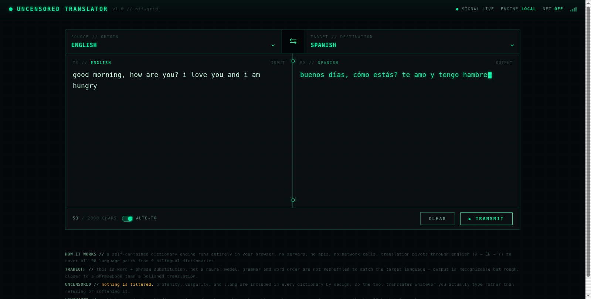
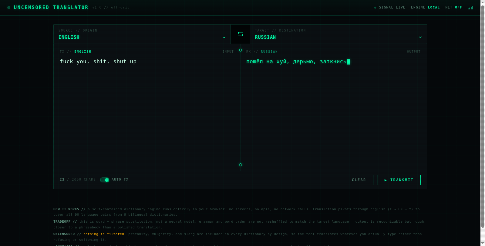
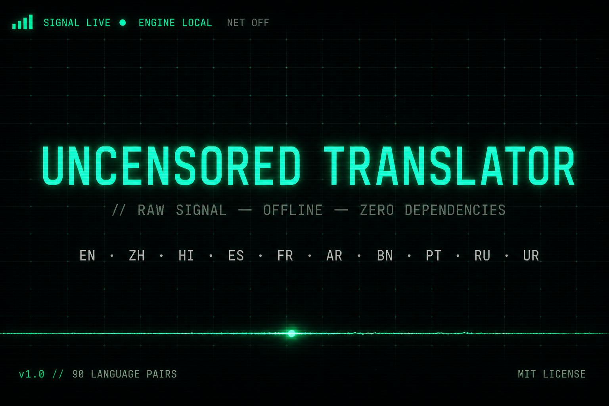

# Uncensored Translator

> A self-contained, offline, **uncensored** translator for the top 10 languages
> by total speakers. No servers. No APIs. No network calls. No dependencies.
> The entire engine — dictionaries and all — runs in your browser.

`Uncensored Translator` is a single HTML file with an inlined dictionary /
phrase-substitution translation engine. You type text, pick a source and target
language, and it translates using ~2,500 dictionary entries across 9 bilingual
dictionaries that pivot through English to cover all 90 language pairs. Nothing
is filtered: profanity, vulgarity, and slang are included in every dictionary
**on purpose**, so the tool translates whatever you actually type rather than
refusing or softening it.

It is not a neural model. It does not reshape grammar or word order. It is a
phrasebook-grade translator — recognizable, rough, and honest about it.

---

## Table of Contents

- [Why](#why)
- [Features](#features)
- [The 10 Languages](#the-10-languages)
- [Quick Start](#quick-start)
- [Usage](#usage)
- [How It Works](#how-it-works)
- [Screenshots](#screenshots)
- [Examples](#examples)
- [Project Structure](#project-structure)
- [Building](#building)
- [Testing](#testing)
- [The Honest Tradeoff](#the-honest-tradeoff)
- [Contributing](#contributing)
- [Security](#security)
- [License](#license)
- [Social Preview](#social-preview)

---

## Why

Most online translators are censored, server-dependent, or both. They refuse
profanity, soften vulgarity, phone home to an API, and stop working the moment
the network drops. This project is the opposite on every axis:

- **Uncensored.** If a word is in the dictionary, it translates — including the
  swear words. There is no allow-list, no profanity filter, no "I can't help
  with that" response. The whole point is to translate *any words you put in*.
- **Offline.** The engine is pure JavaScript running in the browser. Zero
  `fetch` calls, zero `XMLHttpRequest`, zero WebSockets, zero CDNs, zero
  analytics. You can download `index.html`, disconnect from the internet, and
  it keeps working.
- **Zero dependencies.** No npm packages at runtime, no build toolchain
  required to *use* it, no framework. It is one file.

The tradeoff is accuracy: this is word-and-phrase substitution, not a
contextual neural model. See [The Honest Tradeoff](#the-honest-tradeoff).

## Features

- **10 languages, 90 pairs.** Translate between any two of the top 10 languages
  by total speakers, in either direction.
- **Pivot-through-English architecture.** 9 bilingual dictionaries
  (English ↔ each other language) combine to cover every pair via a two-step
  `source → English → target` pivot, so both legs get full phrase matching.
- **Longest-phrase-first matching.** Multi-word entries like `"good morning"`
  win over the individual words `"good"` + `"morning"`.
- **Unicode-aware tokenization.** The tokenizer uses
  `[\p{L}\p{N}\p{M}]+` — critically including `\p{M}` combining marks — so
  Devanagari (Hindi), Bengali, and Arabic script input is handled correctly
  rather than split apart at every virama or vowel sign.
- **Uncensored dictionaries.** Profanity, vulgarity, and slang are included in
  every language by design.
- **Terminal "raw signal / wire transmission" UI.** Monospace, scanline
  overlay, grid background, a glowing wire seam, and signal-strength bars.
- **Single file.** Everything inlined into one `index.html` (~110 KB). No
  external assets.
- **Auto-translate.** Type and it translates after a short debounce; or press
  `Ctrl`/`Cmd`+`Enter` to "transmit".
- **Swap & round-trip.** The swap button flips languages and moves the output
  into the source box so you can immediately translate it back.

## The 10 Languages

The top 10 languages by **total speakers** (native + second-language):

| Code | Language    |
|------|-------------|
| `en` | English     |
| `zh` | Mandarin    |
| `hi` | Hindi       |
| `es` | Spanish     |
| `fr` | French      |
| `ar` | Arabic      |
| `bn` | Bengali     |
| `pt` | Portuguese  |
| `ru` | Russian     |
| `ur` | Urdu        |

With English as the pivot, these 9 bilingual dictionaries produce all
`10 × 9 = 90` directed language pairs.

## Quick Start

You only need the one file.

### Option A — just open it

Download [`index.html`](index.html) and open it directly in any modern browser
(Chromium, Firefox, Safari). That's it. No install, no server, no internet.

> Note: opening via `file://` works for this project because it makes no
> network requests. If your browser blocks something, use a static server
> (Option B).

### Option B — serve it locally

```bash
# from the project root
python3 -m http.server 8000
# then open http://localhost:8000/index.html
```

### Option C — embed it anywhere

Drop `index.html` onto any static host (GitHub Pages, Netlify, S3, a USB
stick). It is fully self-contained.

## Usage

1. Open `index.html` in a browser.
2. The left panel is the **source** (defaults to English), the right panel is
   the **target** (defaults to Spanish).
3. Type up to **2,000 characters** in the source box. Translation happens
   automatically after a brief debounce, or press `Ctrl`/`Cmd`+`Enter` to
   transmit.
4. Use the **swap** button (↔) between the panels to flip the languages and
   move the output into the source box for a round-trip.
5. **CLEAR** empties the source.

The header shows live status: `SIGNAL LIVE`, `ENGINE LOCAL`, `NET OFF`, and a
signal-strength readout — a visual reminder that everything is running on your
machine.

## How It Works

The engine (`engine.js`) is a pure dictionary lookup with a pivot. Here is the
flow:

1. **Tokenize.** The input string is split into word tokens using
   `/[\p{L}\p{N}\p{M}]+(?:[''\-\][\p{L}\p{N}\p{M}]+)*/gu`. Non-word characters
   (spaces, punctuation) are preserved as gaps between tokens. The `\p{M}`
   class keeps combining marks attached to their base letters, which is what
   makes Hindi, Bengali, and Arabic input work.

2. **Build lookup tables.** At load time, each bilingual dictionary
   (`DICT_EN_XX`) is compiled into two maps:
   - `fwd[xx][englishWord] = xxWord` (English → other language)
   - `rev[xx][xxWord] = englishWord` (other language → English)

3. **Match longest-phrase-first.** `translateDirect(text, table)` walks the
   token list. At each position it tries to match the longest phrase (up to 6
   word tokens ahead, skipping non-word gaps) against the table. On a hit it
   emits the translation and advances; on a miss it passes the original token
   through unchanged.

4. **Route by direction.** `translate(text, src, tgt)`:
   - `src === tgt` → return the text unchanged.
   - `src === "en"` → one step: `translateDirect(text, fwd[tgt])`.
   - `tgt === "en"` → one step: `translateDirect(text, rev[src])`.
   - otherwise → two-step pivot: `translateDirect(text, rev[src])` produces an
     English intermediate, then `translateDirect(enIntermediate, fwd[tgt])`
     produces the target. **Both legs use full phrase matching.**

The engine exposes `window.TRANSLATOR = { translate, LANGS }` so the UI (and
the test harness) can call it.

## Screenshots

### Clean multi-phrase translation (English → Spanish)



Input `"good morning, how are you? i love you and i am hungry"` →
`"buenos días, cómo estás? te amo y tengo hambre"`. Notice that the multi-word
phrases (`good morning`, `how are you`, `i love you`, `i am hungry`) are each
matched as units, not translated word by word.

### Uncensored proof (English → Russian)



Input `"fuck you, shit, shut up"` → `"пошёл на хуй, дермо, затканись"`. Nothing
is filtered. The footer in the app states this explicitly: *"nothing is
filtered. profanity, vulgarity, and slang are included in every dictionary by
design."*

## Examples

These are real outputs from the test harness (`node test_engine.js`):

**Direct pairs (English → X):**

```
[en->es] "hello"              =>  "hola"
[en->es] "good morning"       =>  "buenos días"
[en->es] "i love you"         =>  "te amo"
[en->es] "how are you"        =>  "cómo estás"
[en->zh] "i love you"         =>  "我爱你"
[en->fr] "what is your name"  =>  "comment tu t'appelles"
[en->ru] "i am hungry"        =>  "я голоден"
[en->ar] "thank you"          =>  "شكرا"
[en->hi] "see you later"      =>  "बाद में मिलते हैं"
```

**Pivot pairs (X → Y via English) — both legs get phrase matching:**

```
[es->ru] "hola"          =>  "привет"
[es->fr] "te amo"        =>  "je t'aime"
[es->zh] "buenos días"   =>  "早上好"
[fr->es] "merci"         =>  "gracias"
[ru->es] "привет"        =>  "hola"
[zh->en] "你好"          =>  "hello"
[zh->es] "你好"          =>  "hola"
```

**Uncensored (by design):**

```
[en->es] "fuck you"    =>  "vete a la mierda"
[en->ru] "shit"        =>  "дерьмо"
[en->fr] "shut up"     =>  "ta gueule"
[en->zh] "bullshit"    =>  "胡说八道"
```

**Passthrough for unknown words (no crash, no refusal):**

```
[en->es] "the quick brown fox jumps over the lazy dog"
        =>  "the quick brown fox jumps over the lazy perro"
[en->es] "supercalifragilistic"  =>  "supercalifragilistic"
```

Unknown words pass through unchanged. Known words (`dog` → `perro`) still
translate. The engine never throws on unfamiliar input.

### Using the engine from JavaScript

The engine is reusable. Load `index.html` (or eval the source files in Node)
and call the exported API:

```js
// In the browser (index.html is loaded):
const { translate, LANGS } = window.TRANSLATOR;

translate("i love you", "en", "es");   // "te amo"
translate("te amo",     "es", "fr");   // "je t'aime"  (pivot via English)
translate("你好",       "zh", "en");   // "hello"
translate("fuck you",   "en", "ru");   // "пошёл на хуй"

LANGS; // ["en","zh","hi","es","fr","ar","bn","pt","ru","ur"]
```

```js
// In Node (for scripting/testing):
global.window = {};
const fs = require("fs");
const code = ["dict_part1.js", "dict_part2.js", "engine.js"]
  .map(f => fs.readFileSync(f, "utf8")).join("\n;\n");
eval(code);
const { translate, LANGS } = global.window.TRANSLATOR;
translate("good morning", "en", "zh"); // "早上好"
```

## Project Structure

```
uncensored-translator/
├── index.html         # ASSEMBLED, self-contained, shippable file (~110 KB)
├── build.js           # Assembly script (ui.html + styles.css + dicts + engine + ui -> index.html)
├── ui.html            # HTML template with CSS/JS injection markers
├── styles.css         # Terminal "raw signal / wire transmission" aesthetic
├── dict_part1.js      # EN-ZH, EN-HI, EN-ES, EN-FR dictionaries (~1,250 entries)
├── dict_part2.js      # EN-AR, EN-BN, EN-PT, EN-RU, EN-UR dictionaries (~1,250 entries)
├── engine.js          # Tokenizer + longest-phrase-first matcher + pivot router
├── ui.js              # Dropdowns, auto-translate, swap, transmit, char counter
├── test_engine.js     # Node test harness (no framework — plain assertions)
├── screenshots/       # README screenshots
│   ├── clean-translation.png
│   └── uncensored-proof.png
├── README.md
├── LICENSE            # MIT
├── CONTRIBUTING.md
├── CODE_OF_CONDUCT.md # Contributor Covenant v2.1
└── SECURITY.md
```

**Dictionary total:** ~2,500 entries across 9 bilingual dictionaries.

## Building

The shipped file is `index.html`, but it is **assembled** from the source files
by a tiny Node script. Do not hand-edit `index.html` — edit the sources and
rebuild.

```bash
node build.js
# OK  assembled index.html  (109.1 KB)
```

`build.js` reads `ui.html`, injects `styles.css` into the CSS marker and the
concatenated `dict_part1.js + dict_part2.js + engine.js + ui.js` into the JS
marker, and writes `index.html`. The build is deterministic: running it on
unchanged sources reproduces a byte-identical file.

## Testing

```bash
node test_engine.js
```

The harness simulates the browser globals, evaluates the dictionaries and
engine, and prints translations for direct pairs, pivot pairs, profanity, and
passthrough cases. Read the output by eye — if a line shows the expected
translation, the test passes. Add new cases to the bottom of the file as you
add dictionary entries.

## The Honest Tradeoff

This project is deliberately **not** a neural machine translation system. Be
aware of what that means:

- **No grammar reshuffling.** Word order is not rearranged to match the target
  language. A sentence like English *"i am hungry"* may come out as the
  target-language words in English order. The output reads like a phrasebook,
  not a polished translation.
- **No context / disambiguation.** A word with multiple senses picks one
  dictionary entry. There is no context window.
- **Coverage is finite.** Only ~2,500 entries exist. Unknown words pass through
  unchanged (see the "supercalifragilistic" example). There is no fallback
  model.
- **Pivot loss.** A two-step `X → English → Y` pivot can lose nuance that a
  direct X→Y dictionary would preserve, because the English intermediate is
  the bottleneck.

This is the price of being offline, dependency-free, and uncensored. If you
need grammatically correct, context-aware translation, use a neural service.
If you need a private, offline, no-nonsense word-and-phrase translator that
won't refuse your input, use this.

## Contributing

Contributions are welcome — especially **more dictionary entries** (better
coverage means better pivots). See [CONTRIBUTING.md](CONTRIBUTING.md) for the
development setup, coding standards, and pull request process.

A few highlights:

- **Zero dependencies** is a hard rule. Do not add npm packages, CDNs, or
  network calls.
- **Uncensored by design.** Do not "clean up" dictionary profanity — that
  defeats the project's purpose (and is explicitly out of scope in
  `SECURITY.md`).
- **Edit sources, rebuild.** Never hand-edit `index.html`. Run `node build.js`
  after source changes and commit the rebuilt file.
- **Render output as text, never `innerHTML`**, to avoid XSS from
  translated strings.

All contributors agree to abide by the [Code of Conduct](CODE_OF_CONDUCT.md)
(Contributor Covenant v2.1).

## Security

See [SECURITY.md](SECURITY.md) for the vulnerability reporting policy. In
short: report privately, not via a public issue. Note that **profanity in the
dictionaries is explicitly out of scope** — it is an intended feature, not a
security issue.

Security-relevant properties of the codebase: no `innerHTML` of untrusted
translation output, no `eval` of user input, no network calls at runtime, no
external dependencies.

## License

This project is licensed under the **MIT License** — see [LICENSE](LICENSE).

You are free to use, copy, modify, merge, publish, distribute, sublicense, and
sell copies of the software. The only requirement is that the copyright notice
and permission notice be included in all copies or substantial portions of the
software. The software is provided "as is", without warranty of any kind.

## Social Preview

A social preview image is provided at
[`assets/social-preview.png`](assets/social-preview.png) for link unfurls
(Twitter/X, Slack, Discord, LinkedIn) and the GitHub repository sidebar.



To set it on GitHub: **Repo → Settings → Social preview → Edit → Upload an
image…** → choose `assets/social-preview.png`.

See [`assets/SOCIAL-PREVIEW.md`](assets/SOCIAL-PREVIEW.md) for the generation
prompts (including variant prompts) so you can regenerate or customize it.
